Reddit Clone App 🚀

A Reddit Clone built with Flutter using Firebase as backend services and Riverpod for state management.
This project is inspired by Reddit’s core features, including authentication, posts, communities, voting, and more.

✨ Features
🔑 Authentication
Google Sign-In
Guest login
👥 Communities
Create and join communities
Community profile & banner images
📝 Posts
Create image, text, and link posts
Upload images from device (mobile/web)
Post to specific communities
👍👎 Voting System
Upvote / Downvote posts
💬 Comments
Comment on posts
🏅 Awards
Give awards to posts
🎨 Theming
Dark/Light theme toggle
🌐 Cross-platform
Works on Android, iOS, and Web
🛠️ Tech Stack
Flutter (UI framework)
Riverpod (state management)
Firebase
Authentication
Firestore (Database)
Storage (for images)
Dio (networking)
Routemaster (navigation)
Shared Preferences (local storage)
AnyLinkPreview (link preview support)
📂 Folder Structure
lib/
 ├── core/            # Constants, utils, theme, common widgets
 ├── features/
 │    ├── auth/       # Authentication logic & UI
 │    ├── community/  # Communities feature
 │    ├── posts/      # Post creation, feed, and details
 │    ├── feed/       # Home feed
 ├── models/          # Data models
 ├── responsive/      # Responsive UI helpers
 └── theme/           # App theming

🚀 Getting Started
Prerequisites
Flutter SDK
Firebase Project
Android Studio / VS Code
Emulator or physical device
Installation

Clone this repo:

git clone https://github.com/PremmChand/reddit_clone.git
cd reddit_clone

Install dependencies:

flutter pub get

Set up Firebase:

Add your google-services.json (Android) and GoogleService-Info.plist (iOS).
Enable Firebase Authentication, Firestore, and Storage.
Update Firebase configs in the app.

Run the app:

flutter run

📸 ## App Screenshots
    assets/
| 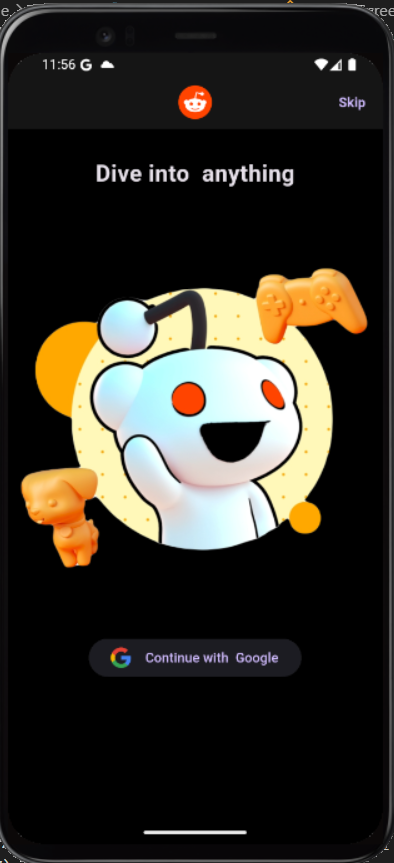 | 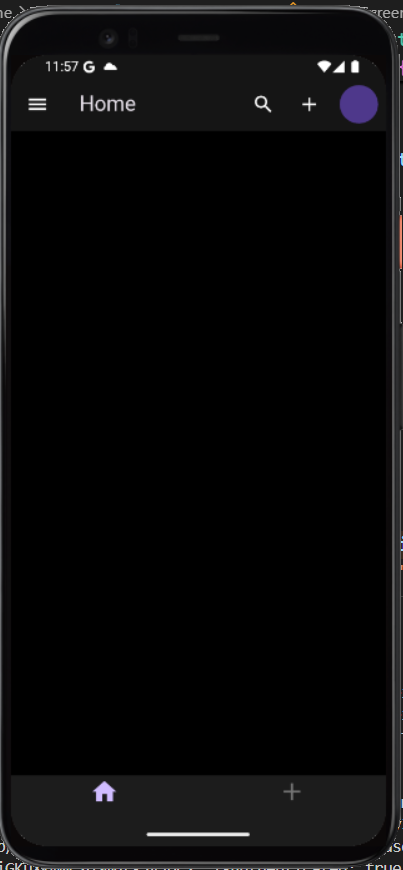 | 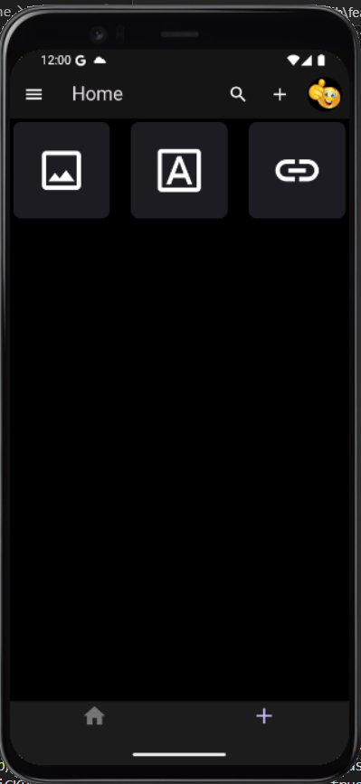 | 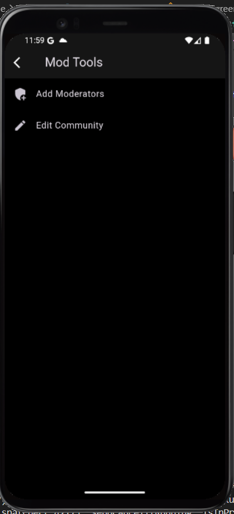 |
|----------------------------------------|--------------------------------------|-----------------------------------------|-------------------------------------|
| Login Page | Home Page | Home 1 Page | Mode Page |

| 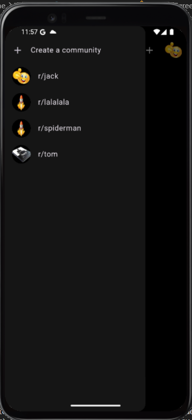 | 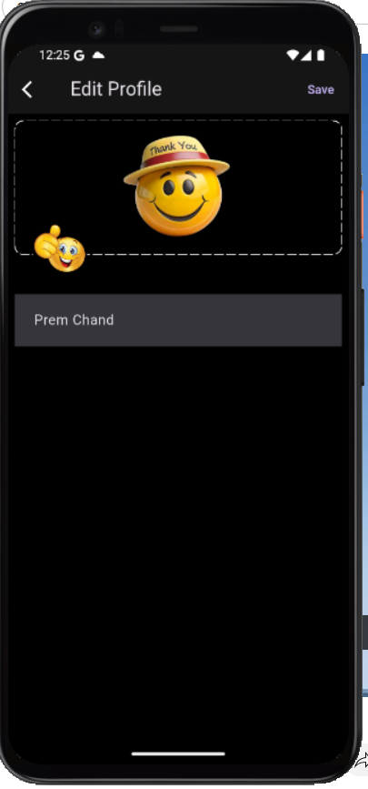 | 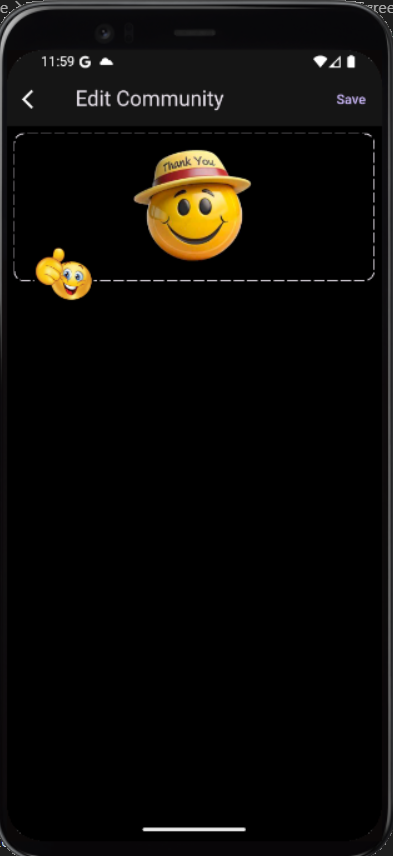 | 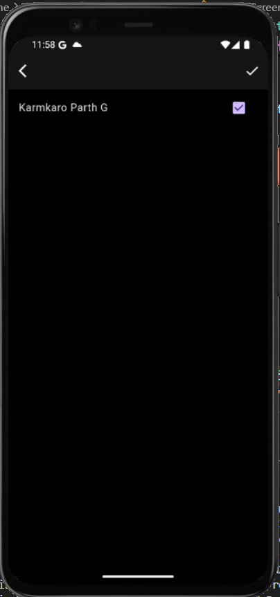 |
|----------------------------------------------------|-----------------------------------------------------|--------------------------------------|--------------------------------------------|
| Communities | Edit Profile | Edit | Moderator |

| 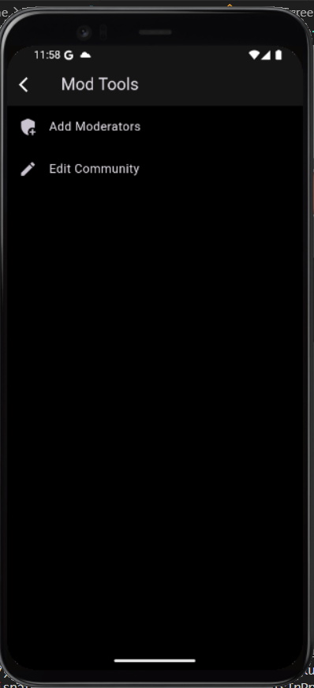 | 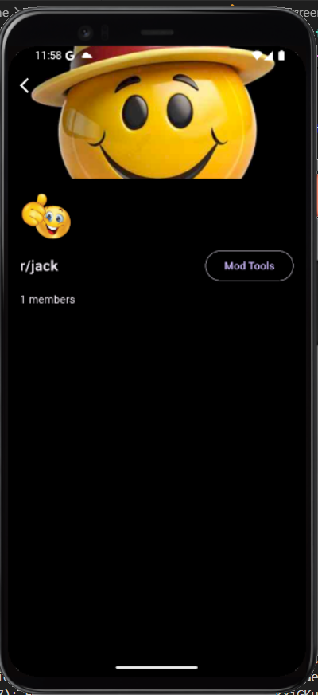 | 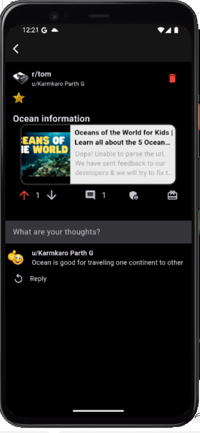 |  |
|----------------------------------------------------|--------------------------------------|-----------------------------------------------------|------------------------------------------------------|
| Mods Detail | Mods | Post Comment | Post Comment 1 |

|  | 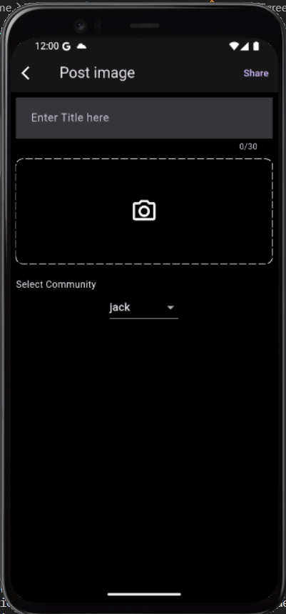 | 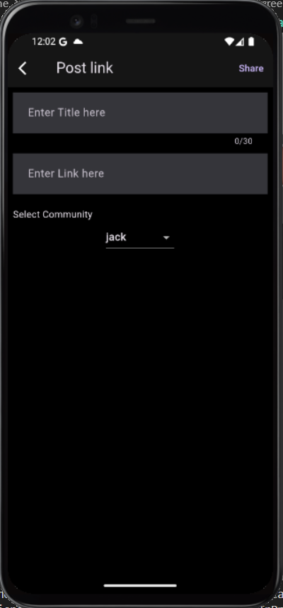 | 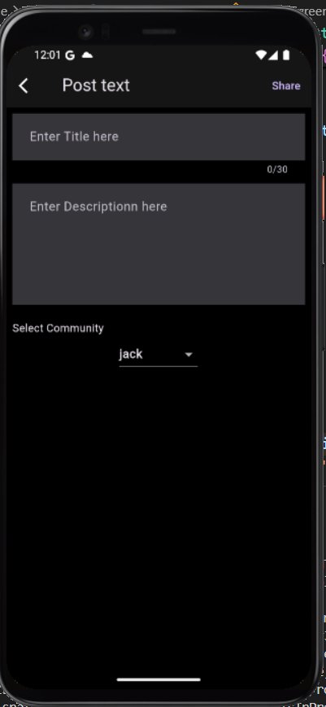 |
|--------------------------------------------------------|-----------------------------------------------|-----------------------------------------------|----------------------------------------------|
| Post Comment 2 | Post Image | Post Link | Post Text |

| 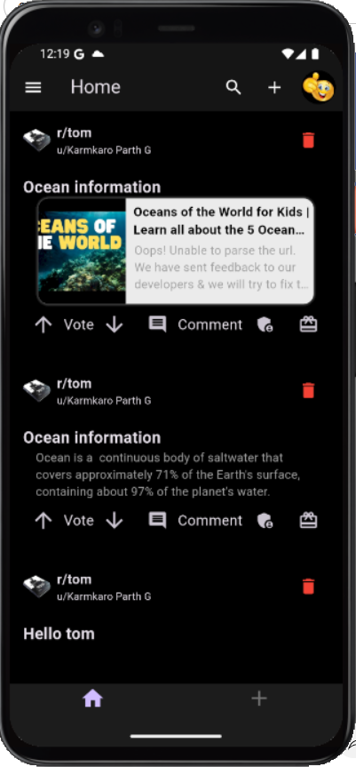 | 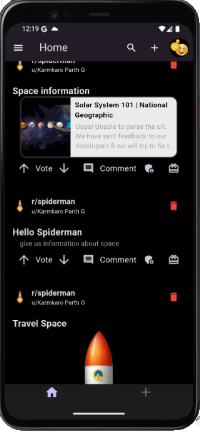 | 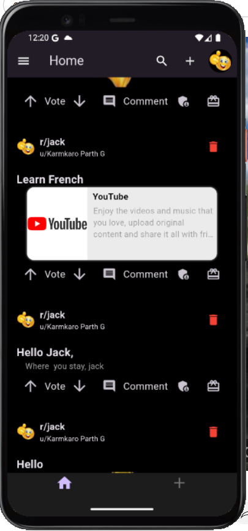 |  |
|----------------------------------------|-----------------------------------------|-----------------------------------------|--------------------------------------------|
| Posts | Posts 1 | Posts 2 | User Comment |

| 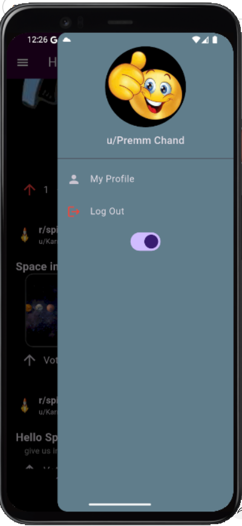 |  |  |  |
|------------------------------------------------------|--|--|--|
| User Profile |  |  |  |

Developed by Premm Chand.